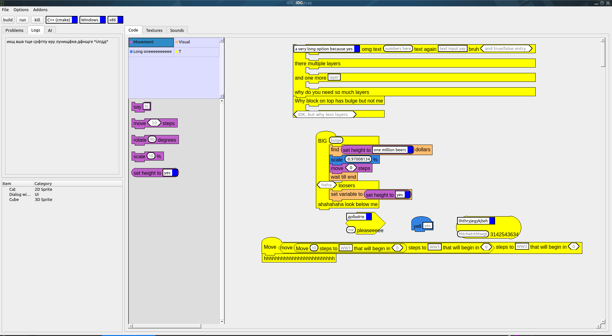
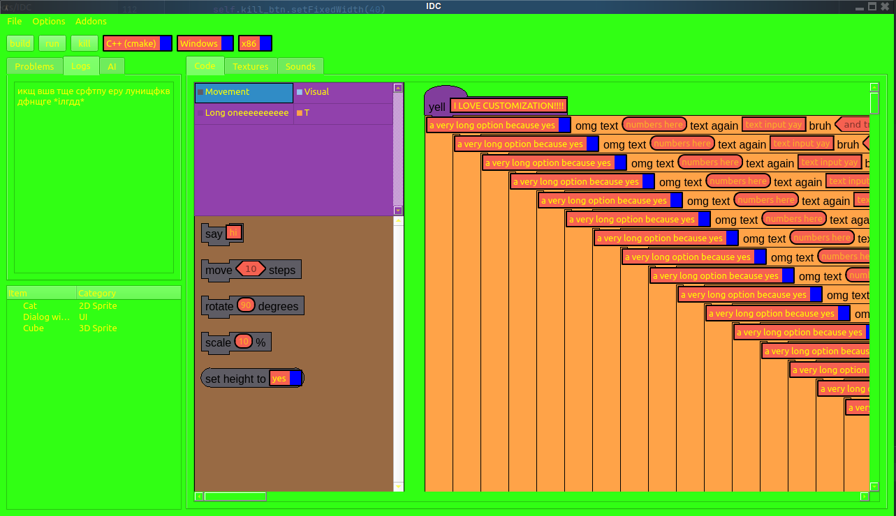
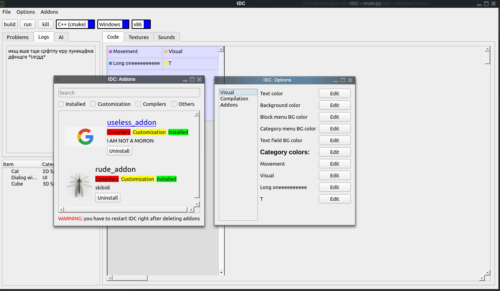

# IDC

#### Also check TUTORIAL.MD to get install instaructions
##### And TODO.txt to see future features
IDC will be a block-based coding app for c++ when done. Currently, there's less than 50% coded, but it already features:

- Very low memory usage - initially consuming 150 MB, 
spamming blocks makes it increase very slowly (5 blocks = max. 1 additional MB consumed)

- Blocks - everything except converting to code

- Addons - everything except filtering and searching done

- Options - you can customize almost every color, but switching tabs crashes the app

- Backend - after a few adjustments, you can make it compile a c++ project

- Block selection menu - completely done

### Footage

  
  
  

